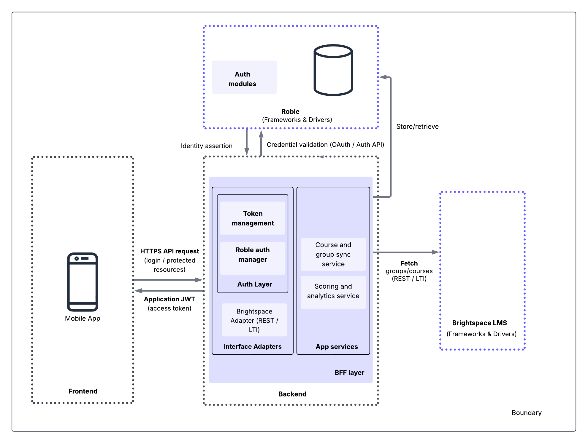
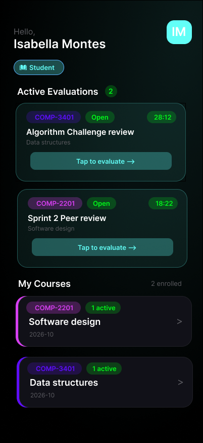
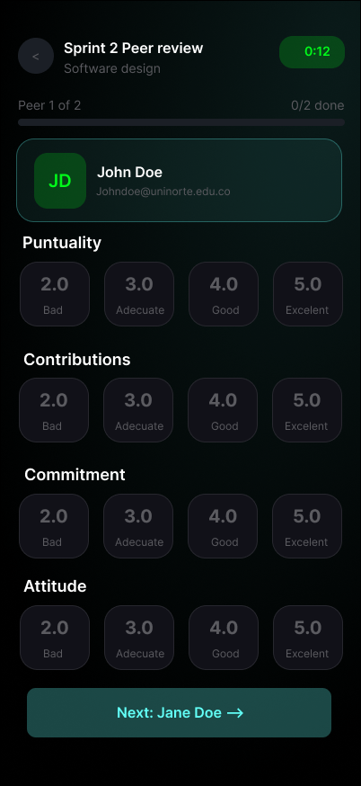
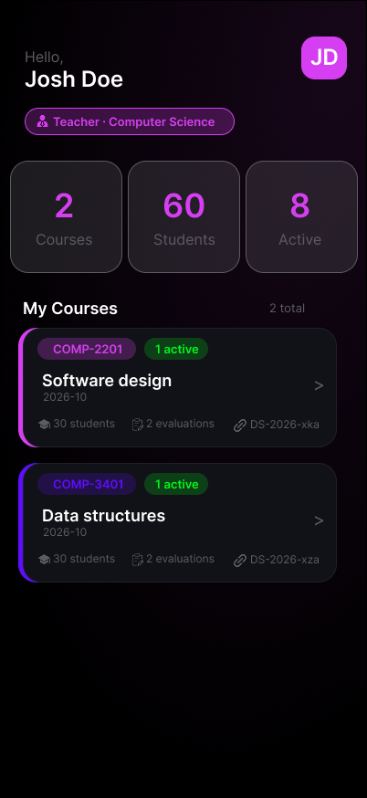

# Evaluo

**Fair, structured, and transparent peer assessment for academic collaboration.**

[Overview](#-overview) · [Features](#-features) · [Architecture](#-architecture) · [Design](#-design) · [References](#-existing-solutions)

---

##  Overview

**Evaluo** is a mobile application built with **Flutter** that enables fair, structured peer assessment in collaborative academic environments. Designed for university courses, it allows students to evaluate teammates based on predefined criteria while giving instructors actionable insights into both group and individual performance.

> Built on real feedback from faculty at **Universidad del Norte**, Evaluo addresses transparency, accountability, and trust gaps in collaborative learning.

---

##  Features

| Feature | Description |
|---|---|
|  **Role-based Access** | Single app with distinct flows for students and instructors |
|  **Structured Rubrics** | Predefined evaluation criteria for consistent, fair assessments |
|  **Performance Insights** | Detailed metrics on individual and group contributions |
|  **Team Management** | Automatic group formation and contribution tracking |

---

##  Architecture

  

 

Evaluo follows a **decoupled architecture** that separates frontend concerns from backend services, enabling:
- **Scalability** — independent scaling of frontend and backend layers
- **Maintainability** — clear separation of concerns across the codebase
- **Security** — role-based access control with properly secured endpoints
- **Flexibility** — backend services can evolve independently of the mobile client

> **Design decision:** A single unified application with role-based access was chosen over multiple independent apps to avoid duplicated business logic, reduce maintenance costs, and improve long-term scalability. This proposal was validated through interviews with faculty from the Systems Engineering Department at Universidad del Norte: Daniel Romero, Eduardo Angulo and Wilson Nieto.

---

##  Design

The UI/UX was designed in Figma with a strong emphasis on clarity, accessibility, and ease of use for both students and instructors.

  
  &nbsp;&nbsp;
  
  &nbsp;&nbsp;
  
  &nbsp;&nbsp;
  

---

##  Existing Solutions

Research into existing peer assessment platforms informed Evaluo's design and feature set.

<strong>Kritik 360</strong> — AI-powered rubric generation & anonymous peer review

 

An educational platform that enhances student engagement through peer-to-peer assessment with predefined rubrics. Its standout feature is an **AI-powered Course Creator** that generates assignments and rubrics from a syllabus upload. Anonymous evaluations reduce bias and promote objective feedback.

🔗 [kritik.io/kritik360](https://www.kritik.io/kritik360)

<strong>FeedbackFruits</strong> — LMS-integrated peer assessment with AI-assisted feedback

 

An LMS-integrated platform (Canvas, Brightspace) that streamlines peer assessment, self-evaluation, and structured feedback. Features AI-assisted feedback generation and automated workflows that reduce administrative workload significantly.

🔗 [feedbackfruits.com](https://feedbackfruits.com)

<strong>Peerceptiv</strong> — Research-backed collaborative evaluation platform

 

Supported by over two decades of academic research, Peerceptiv focuses on anonymous evaluation and measurement of individual contributions within team projects. Students assess peers on professionalism, communication, and work ethic.

🔗 [peerceptiv.com](https://peerceptiv.com)

---

##  Status

Evaluo is currently under **active development** as an academic project. Contributions and feedback are welcome.

---

Made with ❤️ at **Universidad del Norte**

