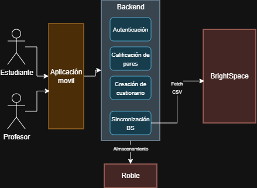
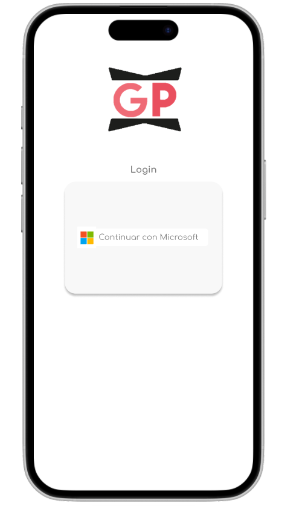
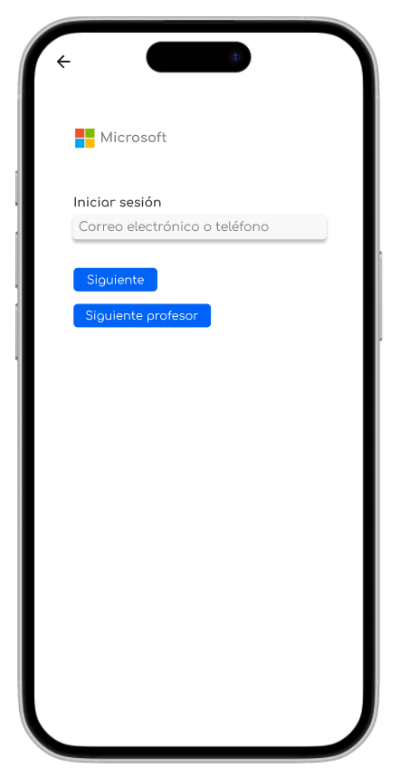
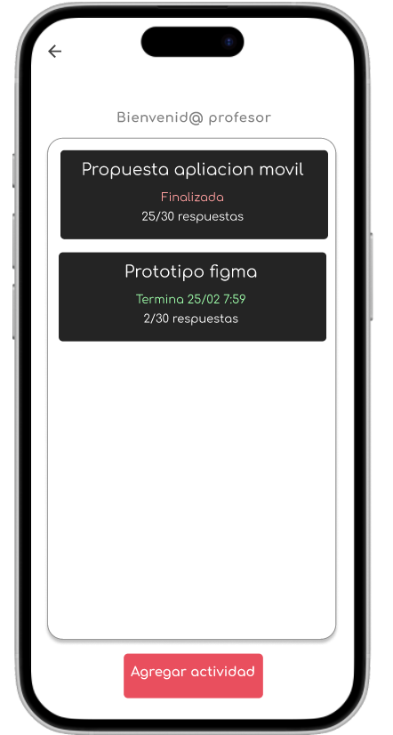
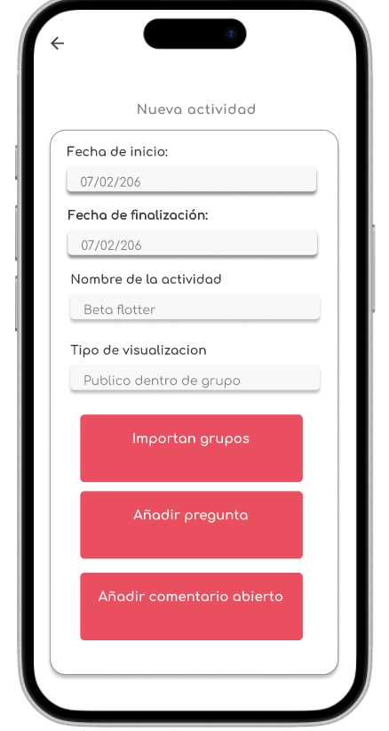
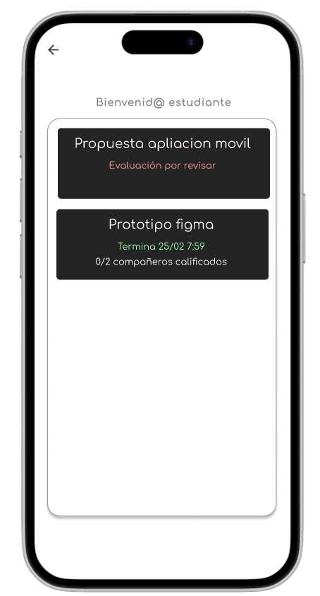
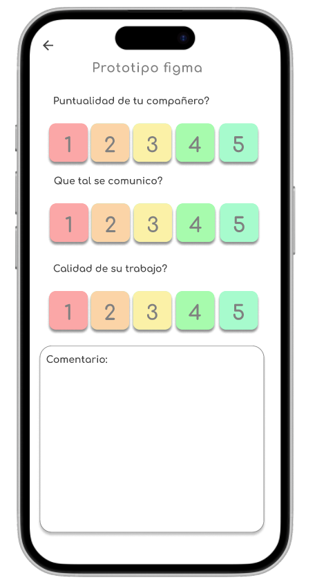
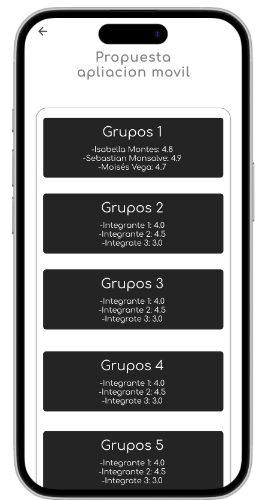
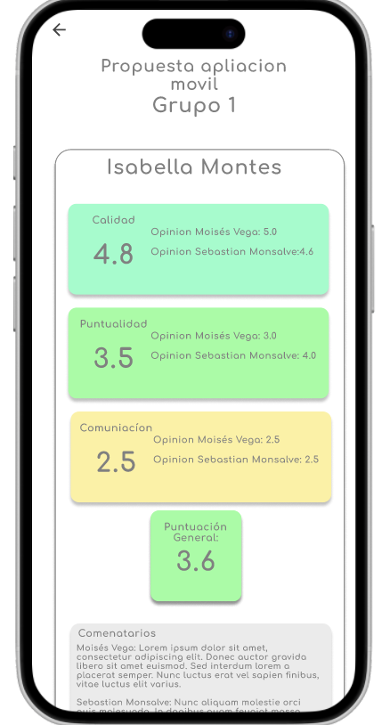
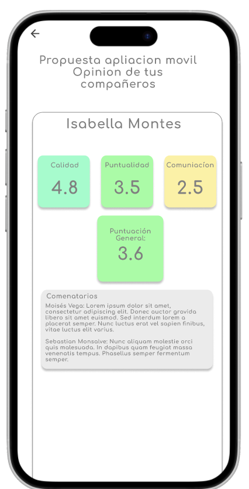

# Propuesta Moisés Vega Molino

## Referentes
* Canvas by Instructure: Es un sistema de gestión de cursos completo, la evaluación entre pares viene incluida como parte de las tareas. Permite asignar revisiones automáticamente, usar rúbricas y configurar el anonimato, todo conectado a los grupos que ya estén dentro del curso. Sin embargo, la evaluación no es su función principal, sino solo una característica más dentro de un ecosistema enorme, alejándose de la idea inicial de una app móvil enfocada en calificar compañeros.

* TEAMMATES: Está diseñado específicamente para evaluación entre pares en trabajo. Se centra en medir cuánto aporta cada persona mediante preguntas que Se pueden personalizar, y genera reportes detallados para el profesor con opciones para controlar si se mantiene el anonimato. Se acerca más a la idea de una app dedicada exclusivamente a evaluar compañeros, aunque funciona como sistema web independiente y no como una app móvil que se integre con otras plataformas.

* Módulo de evaluación docente de la app Uninorteco: Es uno de los módulos dentro de la aplicación de la universidad, aunque está enfocado en la evaluación docentes en lugar de hacer coevaluación, tiene ideas interesantes para la aplicación a diseñar. Usa autenticación con cuentas institucionales, vincula automáticamente al usuario con sus cursos y decisiones de diseño para evitar que la gente responda sin pensar, cambiando de lugar los botones de satisfacción cada vez. Como puntos débiles, el sistema de calificación con estrellas no es muy preciso y, al ser solo un módulo dentro de una app mucho más grande, la evaluación queda como una función secundaria en lugar de ser el centro de atención.

## Composición y diseño de la solución
Un posible enfoque sería una única aplicación móvil con dos tipos de usuario: profesor y estudiante. Esta decisión permite simplificar el desarrollo y mantener coherencia en la experiencia de uso. La diferenciación se manejaría mediante permisos según el rol, evitando duplicar funcionalidades y facilitando la integración con la plataforma de cursos existente.
* Propuesta de arquitectura

## Descripción del flujo funcional
Se empieza desde el lado del profesor, este inicia sesión con su cuenta institucional de Microsoft. 

(Hay dos botones de siguiente debio a limitaciones del figma, no estarian en una versión real)

Una vez dentro, el sistema le muestra los proyectos que ya tiene creados.

 Desde ahí puede crear uno nuevo configurando los datos básicos, o entrar directamente a uno existente. Para armar los equipos, simplemente sube un archivo CSV con la lista de grupos; el sistema se encarga de validar el formato y almacenar la información en la base de datos. Luego configura la coevaluación: establece fechas de inicio y cierre, define si será anónima o identificada, selecciona los criterios o rúbrica y el tipo de preguntas.

Por el lado del estudiante, el proceso inicia también con autenticación mediante cuenta Microsoft. El sistema muestra únicamente los proyectos activos en los que participa y filtra las coevaluaciones que se encuentren dentro del período habilitado. Al seleccionar una evaluación, la aplicación identifica automáticamente el grupo al que pertenece el estudiante y genera dinámicamente el formulario correspondiente. El estudiante califica a cada integrante según los criterios definidos y envía sus respuestas, las cuales quedan almacenadas y asociadas al proyecto.

Una vez finalizado el plazo, el sistema procesa automáticamente la información y calcula métricas agregadas por estudiante y por grupo. El profesor puede acceder a un panel de resultados donde visualiza estadísticas resumidas, promedios y reportes individuales para analizar la contribución dentro del equipo.

 De manera complementaria, el estudiante puede acceder a una sección de resultados personales donde visualiza el resumen de las evaluaciones recibidas por parte de sus compañeros, respetando la configuración de anonimato definida por el profesor.

## Justificación
La propuesta fue validada mediante una entrevista a uno de los docentes del departamento e intercambiar correos con otro, quienes aprobaron la arquitectura de una única aplicación con dos tipos de usuario (profesor y estudiante), considerándola más adecuada que desarrollar dos apps separadas con un mismo backend, ya que simplifica la gestión y mantiene coherencia en el sistema.

Los profesores señalaron que la herramienta podría ser útil para los trabajos en grupo de sus asignaturas, especialmente para identificar la contribución individual. Aquel que fue entevistado, recomendó priorizar preguntas cuantitativas y utilizar escalas tipo Likert para obtener resultados más objetivos, evitando un uso excesivo de respuestas abiertas. También consideró importante ofrecer distintos niveles de privacidad en las evaluaciones y destacó la utilidad de exportar los resultados en formato CSV, lo que facilita integrarlos a sus hojas de cálculo y sistema de notas ya existente.
## Figma
[Link del prototipo en figma](https://www.figma.com/design/eGKpkQaAE2BKVeXSkOy4RQ/Moises_Vega_Prototipo_Movil?node-id=0-1&t=sB0vrHInuzc7SG7h-1).