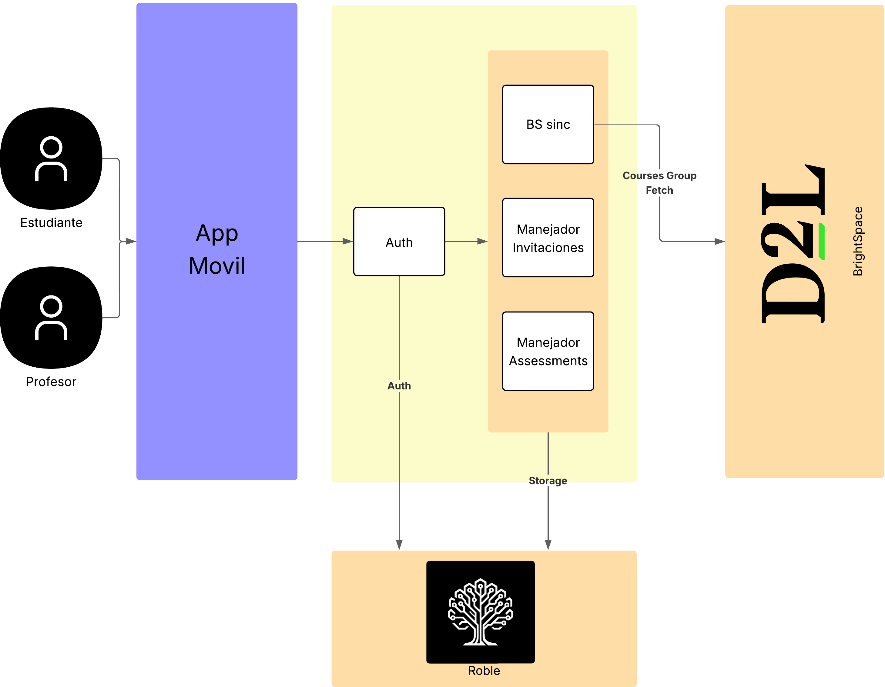
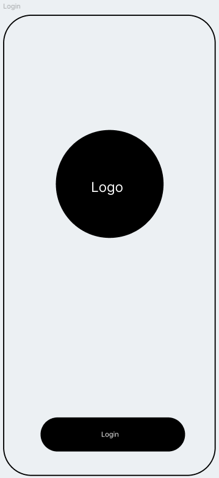
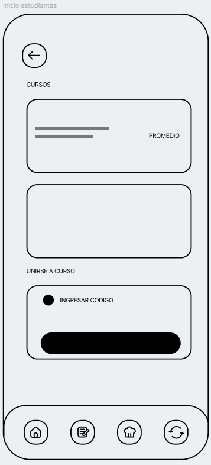
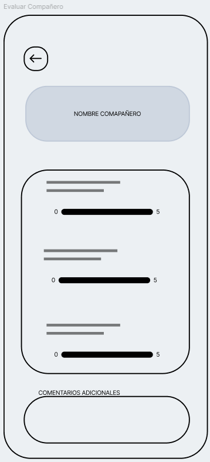
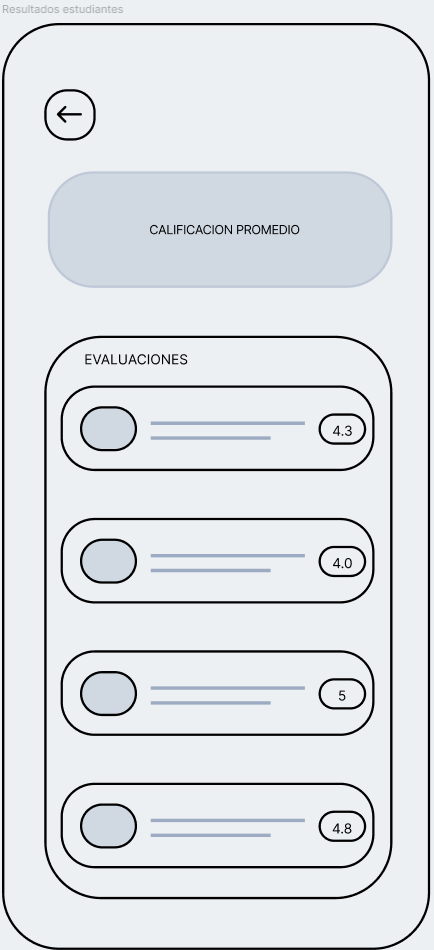
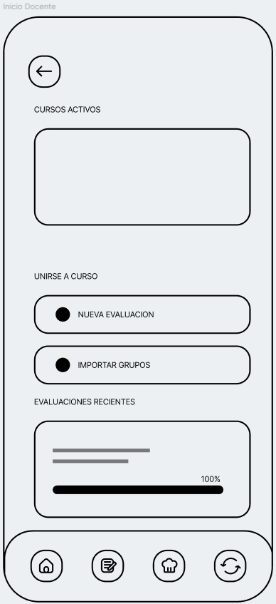
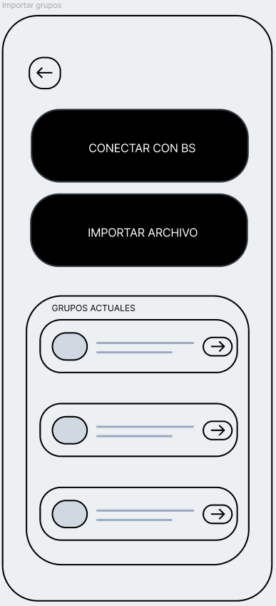
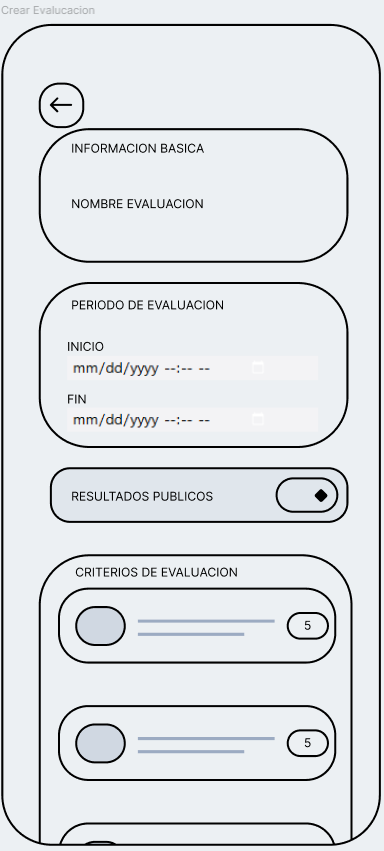

# PeerEval — Aplicación de Evaluación entre Pares en Trabajo Colaborativo

## 1. Referentes

### FeedbackFruits

- Plataforma educativa que incluye herramientas de evaluación entre pares integradas en LMS universitarios.

- Su módulo Peer Review permite que los estudiantes evalúen el desempeño y entregables de sus compañeros mediante rúbricas configurables.

- Permite evaluación entre miembros de un mismo grupo

- Usa criterios definidos por el docente

- Genera reportes analíticos del desempeño individual y grupal

- Facilita retroalimentación estructurada

- Soporta evaluaciones con ventana de tiempo

### Peergrade

- Plataforma especializada en evaluación y retroalimentación entre pares enfocada en mejorar el aprendizaje activo y la reflexión crítica de los estudiantes.

- Permite a los docentes diseñar actividades de evaluación con rúbricas personalizadas, criterios multicategoría y escalas de puntuación configurables.

- Facilita que los estudiantes evalúen trabajos o desempeño de sus compañeros y reciban feedback estructurado de múltiples evaluadores.

- Incluye mecanismos de anonimato opcional, lo que reduce sesgos y favorece la honestidad en las evaluaciones.

- Ofrece automatización en la asignación de evaluadores y recordatorios de evaluación.

- Puede integrarse con algunos LMS, pero su integración con estructuras de grupos institucionales es limitada y depende de configuraciones adicionales.

- No está orientada a evaluación del comportamiento y compromiso dentro del trabajo en equipo, sino principalmente a la revisión de entregables académicos.

- Su experiencia es mayormente web, con limitaciones en enfoque mobile-first, lo que abre oportunidad para propuestas como PeerEval.

### CATME

- Plataforma académica basada en investigación diseñada para la formación y evaluación de equipos de trabajo en contextos educativos.

- Permite realizar evaluaciones entre pares centradas en el comportamiento colaborativo, considerando dimensiones como contribución al trabajo, interacción con el equipo, responsabilidad, calidad del desempeño, gestión del tiempo

- Incluye mecanismos para la formación automática de equipos y seguimiento del desempeño a lo largo del tiempo.

- Permite importar estudiantes y grupos desde sistemas institucionales, facilitando su uso en cursos con gran número de participantes.

- Ofrece modelos de evaluación validados en investigación educativa, lo que aporta rigor metodológico a la evaluación del trabajo colaborativo.

---

## 2. Arquitectura propuesta

### Decisión arquitectónica

Una sola aplicación móvil con control de acceso basado en roles (docente y estudiante)

### Justificación

- Reduce la complejidad de desarrollo
- Mejora la consistencia en la experiencia de usuario
- Permite reutilización de componentes
- Una sola aplicación simplifica la comunicación con el backend y la integración con servicios como LMS

---

### Arquitectura general

### Alternativa

- En caso de no poder utilizar la API de BS, el modulo de sincronizacion se utilizaria para poder importar la informacion exportada por la plataforma acerca de un curso y asemejarse a la sincronizacion del curso.

---

## 3. Flujo funcional

### 3.1 Configuración del curso

1. Docente crea curso
2. Docente invita estudiantes (Comparte codigo del curso)
3. Grupos son importados desde Brightspace (O por Archivo importado)

---

### 3.2 Creación de evaluaciones

1. Docente selecciona:
   - Categoría de grupos
   - Nombre de evaluación
   - Ventana de tiempo
   - Visibilidad (pública o privada)
2. Define criterios de evaluación
3. Publica la evaluacion

---

### 3.3 Proceso de evaluación

1. Estudiantes reciben notificación
2. Evalúan a sus compañeros (sin autoevaluación)
3. Se almacenan resultados
4. Evaluación se cierra automáticamente al finalizar el tiempo

---

### 3.4 Visualización de resultados

Docente puede ver:

- Promedio por grupo
- Promedio por estudiante
- Resultados detallados por criterio

Estudiante puede ver (si es pública):

- Puntajes individuales recibidos
- Resultados agregados del grupo

---

## 4. Prototipo

Prototipo en Figma:

https://www.figma.com/design/EGfOUl56YLD6I4O3NPZP6S/%F0%9F%93%B2Wireframes-for-mobile-UI-design--Community-?node-id=978-2&t=QeNUsHCuSi9GecmH-1

### Capturas

  
  

---

## 5. Justificación basada en entrevistas y referentes

### Entrevista Profesor Eduardo Angulo

- Comenta que desde su punto de vista realizar en una sola aplicacion visto que es muy posible que haya funciones iguales entre perfil, por lo cual se generaría repetición. Crearía problemas del mantenimiento crear 2 aplicaciones diferentes.

- Para la arquitectura el escogería una arquitectura desacoplada debido a que es buena al separar todo y poder ser más flexible con el front pero da un problema con los permisos por roles. Cada método debe estar asegurado para que no se pueda hacer daños con la base de datos.

- Esta deacuerdo con los 2 niveles de visibilidad donde solo vas a ver la evaluación promedio, y también se pueda ver la evaluación individual pública/anónima acorde a las configuraciones.

---

# 6. Diferenciadores de PeerEval (desarrollo)

## 1. Sincronización directa con LMS

A diferencia de soluciones como Peergrade, cuya integración con LMS depende de configuraciones adicionales, PeerEval propone una sincronización estructural con Brightspace mediante un módulo de sincronización que:

- Importa cursos, estudiantes y grupos automáticamente
- Reduce la carga operativa del docente en la configuración inicial
- Mantiene coherencia entre la estructura del LMS y la app
- Permite actualización incremental de datos del curso

Además, el diseño contempla una alternativa por importación de archivos, lo que garantiza funcionamiento incluso sin acceso a la API institucional.

---

## 2. Diseño mobile-first

Mientras que algunas plataformas presentan limitaciones en experiencia móvil, PeerEval se concibe desde su origen como una aplicación móvil nativa centrada en interacción rápida y continua.

Esto implica:

- Evaluaciones rápidas desde notificaciones push
- Interfaces optimizadas para interacción breve
- Acceso inmediato a resultados y recordatorios
- Mayor frecuencia de participación estudiantil

---

## 3. Evaluación configurable centrada en comportamiento colaborativo

PeerEval combina evaluación de entregables y evaluación conductual del trabajo en equipo mediante:

- Rúbricas configurables por criterio
- Escalas de puntuación personalizadas
- Visibilidad configurable (pública, privada o anónima)
- Ventanas de tiempo automáticas
- Exclusión de autoevaluación

---

## 4. Gestión multi-curso y multi-grupo

PeerEval permite a docentes y estudiantes interactuar simultáneamente con múltiples cursos y grupos dentro de una sola app.

Esto habilita:

- Centralización de evaluaciones
- Reutilización de rúbricas entre cursos
- Comparación de desempeño entre equipos
- Reducción de fricción operativa para docentes

---

## 5. Evaluación privada o pública configurable

PeerEval incorpora un sistema de visibilidad que permite al docente decidir:

- Resultados individuales visibles u ocultos
- Feedback anónimo o identificado
- Visualización agregada del grupo
- Transparencia controlada para evitar conflictos dentro del equipo
